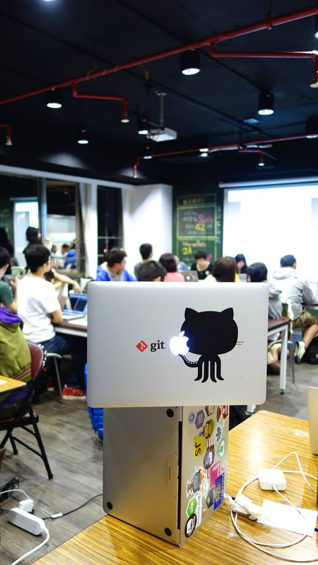

# [fit] JS Girls 使用說明書

---

# About me

> shesee

* Rails Girls Coach
* 五倍紅寶石出礦坑老闆娘

---

五倍的祝福

# 五倍紅寶石

---

---

---

---

# Outline

* Round 1: JavaScript 可以幹嘛
* Round 2: JavaScript 使用說明書

---

# [fit] History

---

# 1995, created by Brendan Eich

---

# [fit] JavaScript v.s. Java ???

---

> LiveScript

---

> JavaScript

---

> Java = 潮

---

# [fit] 真正的名字

---

> ECMAScript

---

# [fit] 可以做什麼？ 

---

> JavaScript，一種直譯式程式語言，是一種動態類型、弱類型、基於原型的語言，內建支援類別。它的直譯器被稱為JavaScript引擎，為瀏覽器的一部分，廣泛用於客戶端的腳本語言，最早是在HTML網頁上使用，用來給HTML網頁增加動態功能。

-- 維基百科

---

# HTML 像是骨架

---

# CSS 像是皮膚

---

# JavsScript 

# 就是可以動起來的肌肉！

---

# 讓我們來把 Y 拍脫光

---

# 資料可視化

[d3.js](http://d3js.org)

具體案例： [g0v 台灣公司關係圖](company-graph.g0v.ronny.tw)

---

# The Useless Web

沒用的網頁

[http://www.theuselessweb.com](http://www.theuselessweb.com)

---

# 後端應用

* Node.js
* Angular.js
* React.js
* xxxxxx.js (?)

---

# Fandora 

> 藝術你的生活

http://www.fandora.tw/

---

# 在 JS 可以運作在 Server 端以後

---

# 優點

* 一個 team 只要懂一種語言就好
* I/O 速度快
* 超方便的非同步執行

---

# 缺點

* 很難 debug
* JS 本身的缺陷

---

# Better

一個更好的 JavaScript

---

---

# 找工作關鍵字

1. JavaScript / JS
2. Front End

---

# 104 以外的選擇

* 國內：[http://jobs.inside.com.tw](http://jobs.inside.com.tw)
* 國外：[LinkedIn](http://linkedin.com)
* 國外：[GitHub Jobs](https://jobs.github.com)

---

# [fit] Round 1 結束！

---

# 說個故事

> 我的書券獎同學

^ 剛畢業的時候，這位超優秀的同學進了某家顧問公司，被交辦了某個繁瑣手工複雜的乏味文件任務，老闆給她九天時間完成。結果我同學花了兩天時間，完全沒有在寫文件，而是想好一個程式去把結果跑出來，兩天後就輕鬆完成這個任務，至此之後變成該公司的傳奇之一。

---

# 你知道嗎

> 會一點程式就可以天生神力

---

# Story Time

---

# [fit] C

---

# [fit] C#

---

# [fit] HTML/CSS/JavaScript

---

# [fit] Ruby

---

# [fit] 雜食

---

# [fit] CodeSchool

---

# [fit] Codecademy

---

# [fit] GitHub

---

> 懶惰

-- 工程師的美德

---

> 如果你覺得寫程式很難

---

> 那是因為你還不知道人生有多複雜

---

# [fit] Round 2 結束！
